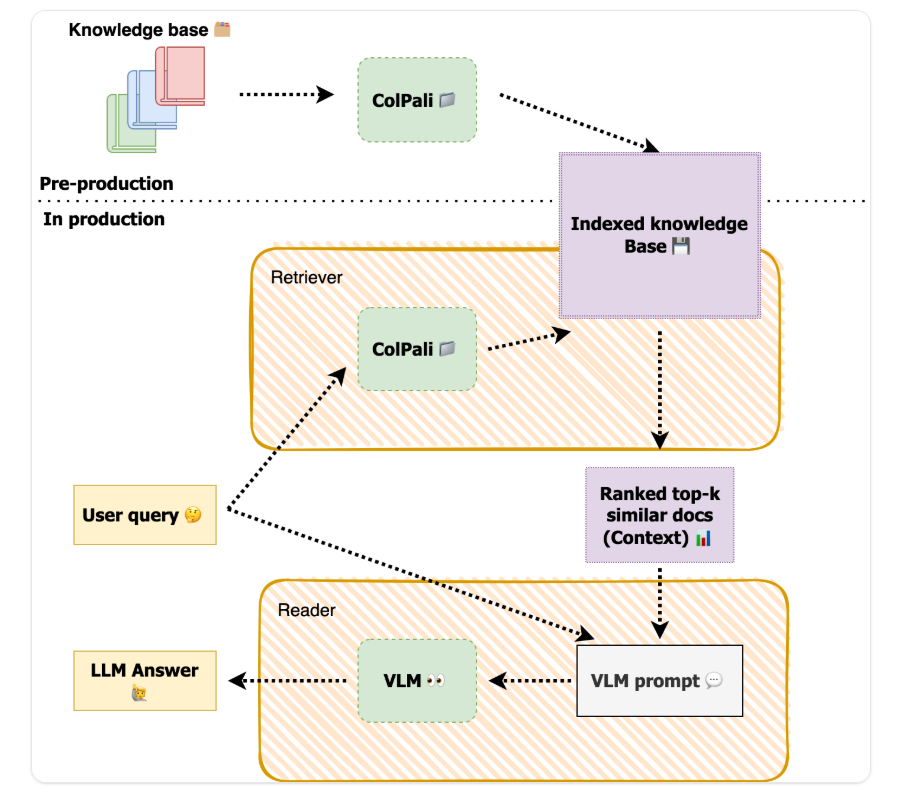

# Visual RAG Pipeline

A **Visual Retrieval-Augmented Generation (RAG)** system for multimodal document understanding. Unlike traditional text-based RAG, this system processes documents as **images**, preserving visual elements that text extraction often loses.

## Why Visual RAG?

Traditional OCR-based RAG struggles with:
- Complex table structures
- Charts and diagrams
- Multi-column layouts
- Handwritten annotations
- Embedded images

This pipeline treats each PDF page as an image, enabling the model to **see** and **reason** over the full visual context.

## How It Works

```
PDF → Page Images → ColPali (Visual Retrieval) → MaxSim Search → Top-K Pages → VLM → Answer
```



## Deployment Options

| Version | Generator | Setup | Guide |
|---------|-----------|-------|-------|
| **Colab** | Llama Vision (Groq API) | Simple, cloud-based | [README_COLAB.md](README_COLAB.md) |
| **Local/Cluster** | Qwen2-VL-7B | HPC deployment, offline | [README_LOCAL.md](README_LOCAL.md) |

## Quick Links

- **Colab Notebook**: [visual_rag_pipeline_colab.ipynb](visual_rag_pipeline_colab.ipynb)
- **Local Script**: [run_visual_rag.py](run_visual_rag.py)

## Models

| Component | Model | Download |
|-----------|-------|----------|
| Retriever | ColPali v1.3 | [HuggingFace](https://huggingface.co/vidore/colpali-v1.3) |
| Base Model | colpaligemma-3b-pt-448-base | [HuggingFace](https://huggingface.co/vidore/colpaligemma-3b-pt-448-base) |
| Generator (Colab) | Llama 4 Scout | via Groq API |
| Generator (Local) | Qwen2-VL-7B-Instruct | [HuggingFace](https://huggingface.co/Qwen/Qwen2-VL-7B-Instruct) |

> **Note**: Models not included in repo (~25GB). See [README_LOCAL.md](README_LOCAL.md) for download instructions.

## Use Cases

- Technical documentation with diagrams
- Financial reports with tables and charts
- Scientific papers with figures
- Scanned documents with mixed content
- Any PDF where layout matters

## License

MIT License
